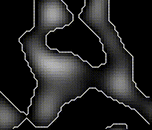

# Marching Squares

## Description

Lately I've been watching some videos from the [The Coding Train](https://www.youtube.com/channel/UCvjgXvBlbQiydffZU7m1_aw) on Youtube, they have awesome content for beginners and advanced programmers. I don't have a solid background on image processing or stuff like that, so I've been really appreciating the content.

One of the videos from the "Coding in the Cabana" series describes the Marching Squares algorihtm and I've decided to give it a go. I've managed to download the Processing IDE and then I thought: "Wait, am I really coding in Java?". Well, next thing I found was this `processing-py` application that lets you code using Python. Is it good? Well, honestly no. It uses Jython on the backend and currently only supports Python 2.7. The performance is not that good and integrating with 3rd party modules is a pain. But, at least for me, it is fun!

So, here you will find an implementation for the Marching Squares algorithm on `processing-py`. 

## How to run?

Because I wrote this using `processing-py` to run this you will have some challenges (sorry!).

1. First things first, you need to install Processing on your local machine, follow the instructions [here](https://processing.org/download/)
2. Now, in order to run this from the command line, follow [this instructions](https://py.processing.org/tutorials/command-line)
3. Finally, to run the program:

```bash
# You need to point the location where the processing-py is stored on your local machine
java -jar /path/to/jar/processing-py.jar processing.py
```

## Some reference images

Some nice viz that I managed to generate:

#### OpenSimplex Noise


